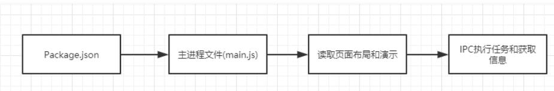

# Electron
* 使用 Web 技术构建跨平台的桌面应用
* Electron = Chromium + Node.js + Native API
    1. Chromium：为 Electron 提供了强大的 UI 能力，可以不考虑兼容性的情况下，利用强大的 Web 生态来开发界面
    2. Node.js：让 Electron 有了底层的操作能力，eg：文件的读写，并且可以使用大量开源的 npm 包来完成开发
    3. Native API：Native API 让 Electron 有了跨平台和桌面端的原生能力，eg：有统一的原生界面、窗口、托盘等

# 搭建开发环境
* 安装
    npm install -g electron  // 全局安装
    npm install electron --sava-dev  // 局部安装
* 查看
    npx electron -v
* 启动
    ./node_modules/.bin/electron  // 安装后，测试使用

# Electron 运行流程

1. 读取 package.json 的中的入口文件，main.js
2. main.js 主程序创建渲染进程
3. 读取应用页面的布局和样式
4. 使用 IPC 在主进程执行任务并获取信息

# Electron 的主进程和渲染进程
* package.json 中定义的入口文件就是主进程，一般一个程序只有一个主进程，但是可以利用一个主进程打开多个子窗口
* 由于 Electron 使用 Chromium 来展示 web 页面，所以 Chromium 的多进程架构也被使用到。每个 Electron 中 Web 页面运行在它自己渲染的进程中，即渲染进程
    * 主进程控制渲染进程，一个主进程可以控制多个渲染进程
    